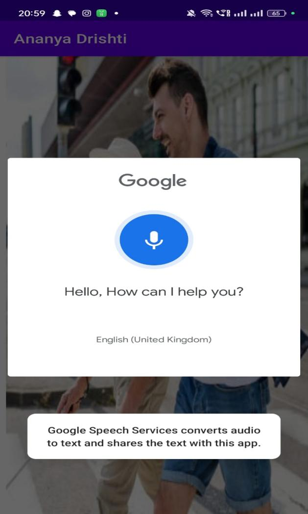
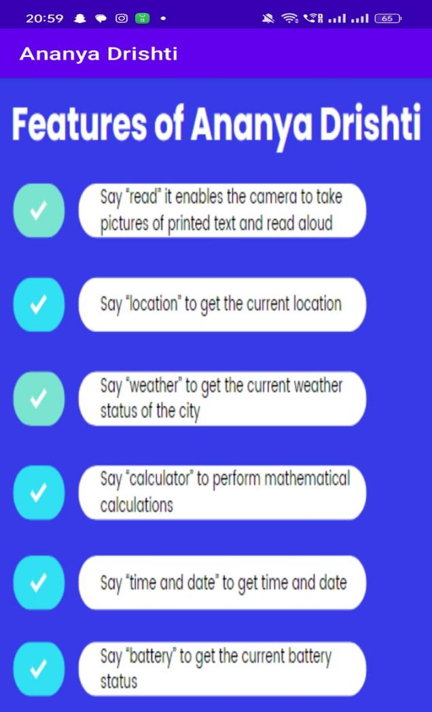
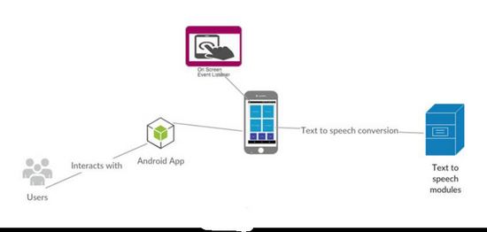

# Ananya Drishti Application

## Problem Definition

Every year, the number of visually challenged persons is increasing due to eye diseases, age-related causes, traffic accidents, and other factors. Reading, being a crucial aspect of daily life, poses significant challenges for visually impaired individuals as text is ubiquitous in newspapers, commercial products, signboards, digital screens, etc. To address this issue, we have developed the Ananya Drishti Android application using OCR Converter System, aiming to provide visually impaired individuals with access to printed text, text boards, scene text, hoardings, and traffic signboard instructions in audio form. The application functions as a camera-based reading system, extracting text from images, identifying text characters and strings, and converting them into audio.

## Aims and Objectives

The aim of this project is to develop a mobile application using Kotlin for Android development, prioritizing accessibility features to empower visually impaired users in accessing and navigating mobile content effortlessly through the integration of text-to-speech technology.

### Objectives:

1. **Switching among Different Voices:**
   - Allow users to select preferred voice options for text-to-speech output.
   - Provide settings to adjust voice speed, pitch, and volume.

2. **Read the Text (OCR Reader):**
   - Enable users to capture printed text using the device's camera.
   - Convert captured text into speech using Optical Character Recognition (OCR) technology.

3. **Calculator:**
   - Implement a built-in calculator for arithmetic calculations.
   - Support basic operations such as addition, subtraction, multiplication, and division.

4. **Weather:**
   - Retrieve real-time weather information using a weather API.
   - Display current conditions, forecasts, and weather alerts.

5. **Location:**
   - Determine the user's current location using GPS.
   - Provide location-based services such as nearby points of interest and navigation assistance.

6. **Battery:**
   - Monitor the device's battery level and status.
   - Display remaining battery percentage and estimated time until depletion.

7. **Time and Date:**
   - Display current time and date within the application.
   - Allow customization of time and date formats.

8. **Exit - Close the App:**
   - Implement a dedicated exit button or menu option.
   - Prompt the user to confirm before closing the application.

The front end of the project involves XML, the programming language is JAVA, and the IDE used is Android Studio.

## Screenshots

    
    

## Scope of the Project

In the scope of our project, which involves utilizing Kotlin for Android development, we prioritize the creation of a mobile application tailored to enhance accessibility for visually impaired users. The foremost aspect of our endeavor is to ensure the application's compatibility with Android devices, guaranteeing its seamless functionality across a broad spectrum of smartphones and tablets running the Android operating system. This entails meticulous optimization to accommodate various screen sizes, resolutions, and device specifications commonly found in the Android ecosystem.

Central to the application's functionality is the integration of text-to-speech technology, allowing users to effortlessly navigate and interact with mobile content through auditory feedback. This feature aims to provide a transformative experience for visually impaired individuals, enabling them to access and comprehend on-screen text with ease. By leveraging Kotlin's capabilities for Android development, we strive to implement this feature seamlessly, ensuring smooth operation and reliable performance across different Android device configurations.

We'll make it easy for visually impaired users to get around with intuitive sound cues and easy-to-use menus on Android. We'll test everything thoroughly, document it well, and be there for ongoing support, so visually impaired users can confidently access digital content.

## System Description

### System Design

### Hardware and Software Requirements

#### Hardware Requirement

- Laptop or PC:
  - Windows 7 or higher
  - i3 processor system or higher
  - 8 GB RAM or higher
  - 100 GB ROM or higher

- Android Phone (6.0 and above)

#### Software Requirement

- Laptop or PC:
  - Android Studio
  
- API:
  - Google Speech API

## Implementation Methodology

- **Requirements Gathering:** Identify and document project requirements, including features, functionalities, and user interface design.
- **Design:** Create system architecture and user interface design to meet project requirements.
- **Development:** Write and test system code according to requirements and design.
- **Testing:** Rigorously test the system to ensure it meets requirements and is free of bugs and errors.
- **Deployment:** Deploy the system to the production environment, ensuring security, reliability, and scalability.

## Conclusion

At present, mobiles apps in smart phones are used to perform the most of our daily activities. But the people with vision impairment require assistance to access these mobile apps through handheld devices like mobile and tablets. Google, Android applications has been developing various mobile apps for visually impaired people Still it need to provide more effective facilities in app by adopting and synergizing suitable techniques from Artificial Intelligence. This report introduced two environmentally-friendly designs for a blind people. We presented information about the Blind people application. This application will be more effective for blind people. It is important to develop this application for the future. The system is used by Blind peoples but the normal people also can use.

## Contributors

Our project's success is a testament to the power of teamwork and collaboration. Each member of our team brought unique skills, knowledge, and enthusiasm to the table, contributing to the project's development in diverse ways.
Here are our group members:

1. [Mangesh Pangam](https://github.com/Mangesh2704)

2. [Rakshita Sarap](https://github.com/RakshitaSarap)

3. [Saish Rane](https://github.com/saishrane-11)

## Acknowledgments

- Special thanks to the developers of Google Cloud Vision API for OCR functionality.
- Inspiration and guidance from various resources and contributors in the field of accessibility technology.
